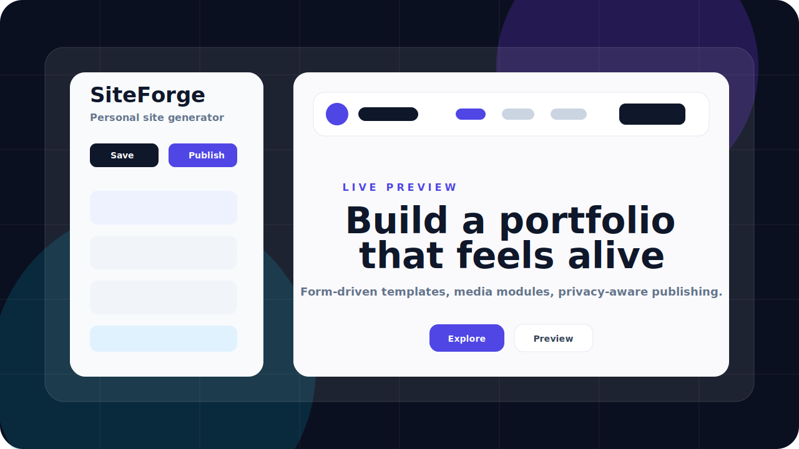
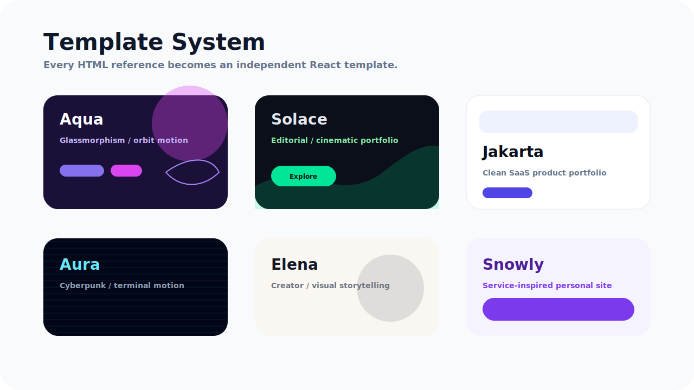
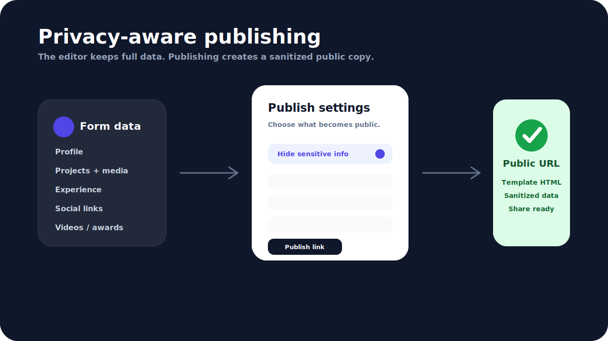

# SiteForge

SiteForge 是一个面向个人作品集的网页生成器。它把用户填写的个人资料、作品、经历、技能、奖项、图片和视频，实时渲染为不同风格的个人网站模板，并支持发布为可在线访问的链接。



## 功能亮点

- **实时预览**：左侧编辑表单，右侧立即展示当前模板效果。
- **多模板体系**：每个个人网站模板都是独立 React 文件，方便把新的 HTML 参考稿改造成模板。
- **表单驱动内容**：作品、视频、经历、技能、奖项、社交链接等都从统一 `SiteData` 读取。
- **媒体上传**：支持本地图片和视频上传，上传后自动回填 URL。
- **在线发布**：废除单文件导出，改为服务端生成在线访问链接。
- **隐私发布**：发布前生成公开版数据，可选择隐藏邮箱、头像、位置、项目链接、GitHub、项目图片、公司名称、经历详情、视频、奖项和博客。
- **预览与发布一致**：前端模板和服务端静态渲染保持同一套视觉与交互逻辑。

## 模板

当前内置模板：

- `Snowly`：紫色品牌感、卡片式个人站。
- `Elena`：创作者风格，强调作品故事和视觉呈现。
- `Aura`：赛博朋克终端风格，带粒子和鼠标动效。
- `Solace`：深绿色高级作品集，偏视觉叙事。
- `Jakarta`：明亮 SaaS 风格作品集，导航随滚动高亮。
- `Aqua`：暗色玻璃拟态，带粒子背景和小飞碟轨道动效。



## 发布与隐私流程

SiteForge 的发布流程不会直接修改编辑器中的原始数据。用户点击发布后，系统会先打开隐私确认弹窗，再根据用户选择生成一份公开版 `SiteData`，最后用该公开数据生成在线链接。



可隐藏内容包括：

- 邮箱、位置、头像、首页背景图
- 社交链接、项目外链、GitHub 链接
- 项目正文、项目封面和项目图集
- 公司/学校名称、经历详情
- 荣誉奖项、视频模块、博客文章

## 技术栈

- Frontend：Vite、React 18、TypeScript、Tailwind CSS、Zustand
- Server：Express、TypeScript
- Shared：前后端共享 `SiteData` 类型
- Tests：Vitest、Testing Library、Supertest

## 项目结构

```text
frontend/
  src/components/       编辑器、上传控件、发布弹窗
  src/templates/        独立 React 模板
  src/store/            Zustand 数据管理
  src/utils/            上传、发布、隐私脱敏工具
server/
  src/index.ts          API 服务
  src/renderStaticHtml.ts  在线发布 HTML 渲染
shared/
  types.ts              前后端共享类型和默认数据
temp/
  *.html                模板改造参考 HTML
docs/images/
  *.svg                 README 项目图片
```

## 本地运行

安装依赖：

```bash
npm install
```

启动后端：

```bash
npm run dev:server
```

启动前端：

```bash
npm run dev
```

默认访问：

```text
http://localhost:5173/
```

## 常用脚本

```bash
npm run typecheck
npm test
npm run build
```

## API 概览

- `GET /api/site/:userId`：读取站点数据
- `PUT /api/site/:userId`：保存完整站点数据
- `POST /api/upload`：上传图片或视频
- `POST /api/publish/site`：根据当前模板和公开版数据生成在线访问链接
- `POST /api/export/html`：已废弃，返回 410
- `POST /api/ai/chat`：AI 接口占位

## 模板开发约定

新增模板时建议遵循：

1. 每个模板放在 `frontend/src/templates/TemplateName.tsx`。
2. 服务端发布渲染同步加入 `server/src/renderStaticHtml.ts`。
3. 表单不适配的原 HTML 模块应移除或改造成 `SiteData` 驱动模块。
4. 图片、视频、作品精选、技能程度、奖项显示都应响应表单数据。
5. 预览页面与发布页面的视觉、动效、模块显隐应保持一致。

## 当前状态

项目已具备首版可运行能力：编辑、预览、模板切换、媒体上传、隐私确认发布、在线访问链接和基础自动化测试。
